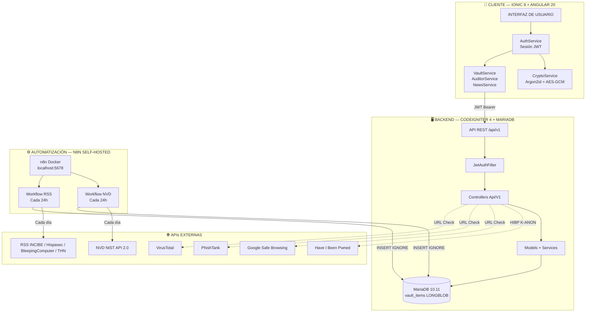
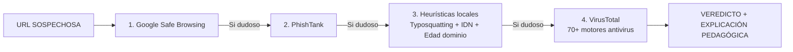
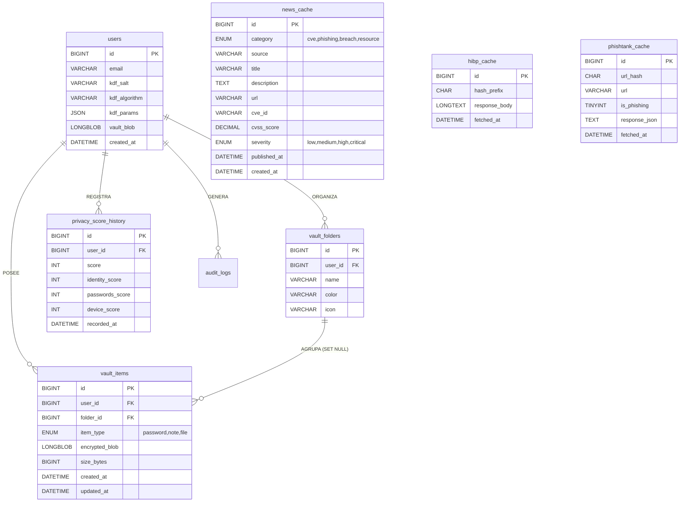
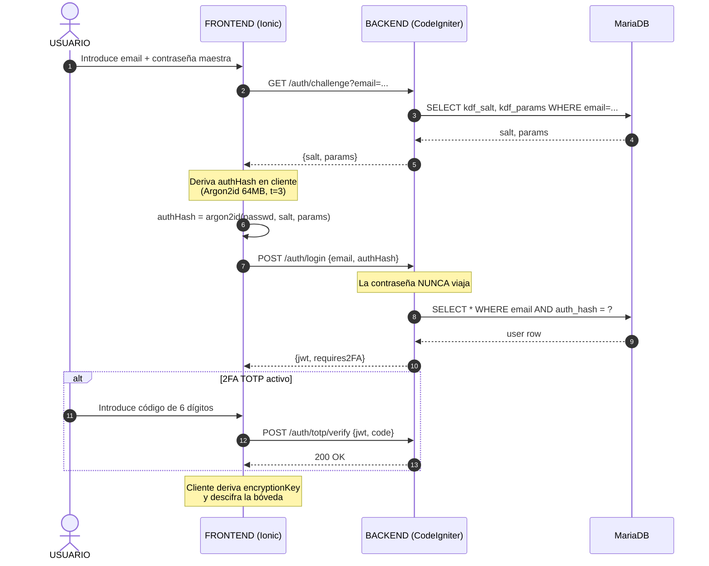

# 🛡️ `ARGOS — SUITE DE CIBERSEGURIDAD ZERO-KNOWLEDGE` 🛡️


---

> [!WARNING]
> ***TRABAJO DE FIN DE GRADO DEL CICLO DE DESARROLLO DE APLICACIONES MULTIPLATAFORMA (DAM). ARGOS RESUELVE LA BRECHA ENTRE PROTECCIÓN, FORMACIÓN Y GAMIFICACIÓN EN CIBERSEGURIDAD PARA EL USUARIO DOMÉSTICO HISPANOHABLANTE***

- ***EL PROYECTO SE COMPONE DE `5 MÓDULOS NÚCLEO` + `1 MÓDULO EXTRA` PARA EL TIER PREMIUM:***

  - ***🔐 `BÓVEDA CIFRADA` — GESTOR DE CONTRASEÑAS CON CIFRADO EN CLIENTE***
  - ***🩺 `AUDITOR DE VIDA DIGITAL` — PRIVACY SCORE BASADO EN HIBP K-ANONYMITY***
  - ***🎣 `ANALIZADOR DE PHISHING` — PIPELINE DE 4 MOTORES (SAFE BROWSING + PHISHTANK + VIRUSTOTAL + HEURÍSTICAS)***
  - ***🎮 `ROADMAP GAMIFICADO` — 5 ITINERARIOS DE APRENDIZAJE CON XP Y RACHAS***
  - ***📰 `PANEL DE NOTICIAS Y ALERTAS CVE` — INGESTA AUTOMÁTICA CON N8N***
  - ***🤖 `ASISTENTE IA` (PREMIUM) — CHATBOT PEDAGÓGICO VÍA PROXY LLM***

---

---

## `MOTIVACIÓN DEL PROYECTO` ⭕

> [!NOTE]
> ***LOS DATOS QUE JUSTIFICAN LA EXISTENCIA DE ARGOS***

- ***`122.223` incidentes gestionados en España en 2025 (+26 % vs. 2024) — INCIBE 2025***
- ***El `60 %` de las brechas de seguridad involucran el factor humano — Verizon DBIR 2025***
- ***Aumento del `400 %` en ataques de QRishing durante 2025***
- ***El `28 %` de usuarios ha sufrido phishing y todavía no sabe detectarlo***

<br>

> [!TIP]
> ***NO EXISTE EN EL MERCADO HISPANOHABLANTE NINGUNA HERRAMIENTA B2C QUE UNIFIQUE PROTECCIÓN INMEDIATA + FORMACIÓN CONTINUA + GAMIFICACIÓN BAJO UN MODELO FREEMIUM EN ESPAÑOL. AHÍ NACE ARGOS***

- ***`TARGET PRINCIPAL`: usuarios domésticos de 25 a 65 años con uso intensivo digital pero sin conocimientos técnicos.***
- ***`TARGET SECUNDARIO`: estudiantes de informática y ciberseguridad que quieran orientar su formación.***
- ***`MODELO DE NEGOCIO`: freemium. Funcionalidades core gratuitas; módulos avanzados (Asistente IA, análisis ilimitados) bajo suscripción premium.***

---

---

## `ESTRUCTURA DEL PROYECTO` ⭕

> [!NOTE]
> ***EL PROYECTO SIGUE UNA ARQUITECTURA `MONOREPO` QUE SEPARA EL FRONTEND MÓVIL, EL BACKEND API Y LA CAPA DE AUTOMATIZACIÓN EN CARPETAS INDEPENDIENTES***

```text
ARGOS/
│
├── frontend/                    # APP IONIC 8 + ANGULAR 20 + CAPACITOR 8
│   ├── src/
│   │   ├── app/
│   │   │   ├── services/        # 9 SERVICIOS REUTILIZABLES
│   │   │   │   ├── api.service.ts            # CLIENTE HTTP CENTRALIZADO
│   │   │   │   ├── auth.service.ts           # SESIÓN JWT + 2FA TOTP
│   │   │   │   ├── crypto.service.ts         # ARGON2ID + AES-GCM EN CLIENTE
│   │   │   │   ├── vault.service.ts          # CRUD CIFRADO DE LA BÓVEDA
│   │   │   │   ├── auditor.service.ts        # PRIVACY SCORE + HIBP K-ANON
│   │   │   │   ├── news.service.ts           # PANEL DE NOTICIAS Y CVE
│   │   │   │   ├── preferences.service.ts    # AJUSTES PERSISTIDOS
│   │   │   │   ├── theme.service.ts          # MODO CLARO / OSCURO
│   │   │   │   └── user-profile.service.ts   # PERFIL DEL USUARIO
│   │   │   ├── login/           # LOGIN ZERO-KNOWLEDGE
│   │   │   ├── register/        # REGISTRO Y DERIVACIÓN DE CLAVES
│   │   │   ├── onboarding/      # TOUR INICIAL PARA NUEVOS USUARIOS
│   │   │   ├── dashboard/       # MENÚ CENTRAL CON LOS 5 MÓDULOS
│   │   │   ├── vault/           # BÓVEDA AES-256-GCM
│   │   │   ├── auditor/         # AUDITOR DE VIDA DIGITAL
│   │   │   ├── phishing/        # ANALIZADOR EDUCATIVO DE URLs
│   │   │   ├── roadmap/         # ITINERARIOS GAMIFICADOS
│   │   │   ├── news/            # PANEL DE NOTICIAS Y CVE
│   │   │   ├── profile/         # PERFIL Y AJUSTES DEL USUARIO
│   │   │   └── shared/          # COMPONENTES Y UTILIDADES COMPARTIDAS
│   │   ├── environments/        # CONFIGURACIÓN DEV / PROD
│   │   └── theme/               # SISTEMA VISUAL (PALETA, TIPOGRAFÍAS)
│   └── package.json
│
├── backend/                     # API REST CODEIGNITER 4 + PHP 8.2 + SHIELD JWT
│   ├── app/
│   │   ├── Controllers/Api/V1/  # 7 CONTROLADORES REST
│   │   │   ├── AuthController.php             # /auth/register, /auth/challenge, /auth/login
│   │   │   ├── TotpController.php             # /auth/totp/* (2FA)
│   │   │   ├── VaultController.php            # /vault/items/*
│   │   │   ├── FolderController.php           # /vault/folders/*
│   │   │   ├── AuditorController.php          # /auditor/hibp, /auditor/score
│   │   │   ├── PhishingController.php         # /phishing/safebrowsing, /phishtank, /virustotal
│   │   │   └── NewsController.php             # /news, /news/stats, /news/breaking
│   │   ├── Models/              # VaultItem, Folder, NewsCache, PrivacyScore, HibpCache, ...
│   │   ├── Services/            # HIBP, SafeBrowsing, PhishTank, VirusTotal, AuthService, AuthJWT
│   │   ├── Filters/             # JwtAuthFilter PARA RUTAS PROTEGIDAS
│   │   ├── Database/Migrations/ # 10 MIGRACIONES (vault, folders, score, news, hibp, ...)
│   │   └── Config/              # Routes, Filters, Auth, Cors, Services
│   ├── .ddev/                   # ENTORNO DOCKERIZADO LOCAL (DDEV)
│   └── composer.json
│
├── automation/                  # ORQUESTACIÓN DE INGESTA AUTOMÁTICA
│   └── n8n/
│       ├── docker-compose.yml   # N8N AISLADO EN localhost:5678
│       ├── workflows/
│       │   ├── nvd-ingest.json  # NVD API 2.0 DEL NIST — CADA 24H
│       │   └── rss-ingest.json  # 4 FEEDS RSS (INCIBE, HISPASEC, BLEEPING, THN)
│       ├── SETUP.md             # GUÍA DE CONFIGURACIÓN INICIAL
│       └── README.md            # DOC OPERATIVA DEL CONTENEDOR
│
├── docs/                        # DOCUMENTACIÓN ACADÉMICA Y DE DISEÑO
│   └── design/                  # MOCKUPS Y SISTEMA VISUAL
│
├── graphify-out/                # SALIDA DEL ANÁLISIS DE GRAPHIFY
│   └── graphify-out/
│       ├── GRAPH_REPORT.md      # INFORME DE COMUNIDADES + GOD NODES
│       ├── graph.html           # VISOR INTERACTIVO DEL GRAFO
│       └── graph.json           # GRAFO COMPLETO 25.003 NODOS
│
├── CONTEXTO_INICIAL.md          # DOCUMENTO FUNDACIONAL DEL TFG
├── claude.md                    # GUÍA INTERNA PARA EL ASISTENTE IA DE DESARROLLO
└── README.md                    # ESTE ARCHIVO
```

---

---

## `DIAGRAMA DE ARQUITECTURA` 🔺

> [!NOTE]
> ***LA ARQUITECTURA SEPARA `CLIENTE`, `BACKEND` Y `AUTOMATIZACIÓN`. EL CLIENTE NUNCA TRANSMITE TEXTO PLANO. EL BACKEND SOLO GUARDA BLOBS OPACOS Y N8N ALIMENTA LA BD CON DATOS EXTERNOS NORMALIZADOS***



---

---

## `STACK TECNOLÓGICO` ⭕

> [!IMPORTANT]
> ***TODAS LAS VERSIONES ESTÁN ELEGIDAS POR SU MADUREZ, COMUNIDAD ACTIVA Y BAJA HUELLA DE MANTENIMIENTO. EL NÚCLEO ES 100 % DE 2026***

### `FRONTEND` 🔻

| TECNOLOGÍA | VERSIÓN | PARA QUÉ |
|---|---|---|
| **Ionic** | 8.x | FRAMEWORK MÓVIL HÍBRIDO |
| **Angular** | 20.x | SPA REACTIVA |
| **Capacitor** | 8.x | PUENTE A APIs NATIVAS DE Android / iOS |
| **Tailwind CSS** | 4.x | ESTILOS UTILITY-FIRST |
| **GSAP** | 3.x | ANIMACIONES DE ALTO RENDIMIENTO |
| **Chart.js** | 4.x | RADAR DE HABILIDADES Y GRÁFICO DE TENDENCIA |
| **hash-wasm** | 4.x | DERIVACIÓN ARGON2ID EN EL CLIENTE |
| **Swiper** | 12.x | CARRUSEL DE ONBOARDING |
| **canvas-confetti** | 1.x | CELEBRACIÓN DE LOGROS DESBLOQUEADOS |
| **Phosphor Icons** | 2.x | ICONOGRAFÍA CONSISTENTE |

<br>

### `BACKEND` 🔻

| TECNOLOGÍA | VERSIÓN | PARA QUÉ |
|---|---|---|
| **CodeIgniter** | 4.7+ | FRAMEWORK PHP MVC |
| **PHP** | 8.2+ | LENGUAJE DEL BACKEND |
| **CodeIgniter Shield** | 1.3+ | AUTENTICACIÓN JWT + 2FA TOTP |
| **MariaDB** | 10.11 | BASE DE DATOS RELACIONAL |
| **firebase/php-jwt** | 7.x | GENERACIÓN Y VALIDACIÓN DE TOKENS JWT |
| **robthree/twofactorauth** | 3.x | GENERACIÓN TOTP COMPATIBLE GOOGLE AUTHENTICATOR |

<br>

### `AUTOMATIZACIÓN` 🔻

| TECNOLOGÍA | VERSIÓN | PARA QUÉ |
|---|---|---|
| **n8n** | latest | ORQUESTACIÓN DE WORKFLOWS |
| **Docker Compose** | v2 | LEVANTA N8N AISLADO EN LOCALHOST |
| **NVD API 2.0** | — | INGESTA DE CVEs CRÍTICOS DEL NIST |
| **RSS Feeds** | — | INCIBE, HISPASEC, BLEEPINGCOMPUTER, THE HACKER NEWS |

<br>

### `INFRAESTRUCTURA Y DEVOPS` 🔻

| HERRAMIENTA | PARA QUÉ |
|---|---|
| **ddev** | ENTORNO DE DESARROLLO PHP LOCAL ESTANDARIZADO |
| **Git + GitHub** | CONTROL DE VERSIONES + KANBAN DE 33 ISSUES |
| **GitHub Actions** | CI/CD (PENDIENTE PARA DESPLIEGUE FUTURO) |
| **Hetzner VPS** | DESPLIEGUE EN PRODUCCIÓN |

<br>

### `CRIPTOGRAFÍA ZERO-KNOWLEDGE` 🔻

| COMPONENTE | ALGORITMO | ESTÁNDAR |
|---|---|---|
| **KDF (derivación de clave)** | Argon2id (64 MB RAM / iter) | RFC 9106 · OWASP Password Storage CS |
| **Cifrado simétrico** | AES-256-GCM | NIST FIPS 197 · Web Crypto API (SubtleCrypto) |
| **Verificación de filtraciones** | k-anonymity SHA-1 (5 chars) | HIBP API v3 |

---

---

## `SEGURIDAD — MODELO ZERO-KNOWLEDGE` 🔻

> [!CAUTION]
> ***EL SERVIDOR `NUNCA` VE LA CONTRASEÑA MAESTRA DEL USUARIO NI EL CONTENIDO DE SU BÓVEDA. TODA LA CRIPTOGRAFÍA SE EJECUTA EN EL CLIENTE. LA CONFIANZA SE DESPLAZA DEL SERVIDOR AL CLIENTE***

### `CIFRADO DE CLAVE (KDF ARGON2ID)` 🔺

> [!TIP]
> ***SE USA `ARGON2ID` EN LUGAR DE PBKDF2 PORQUE ES MEMORY-HARD (64 MB POR INTENTO), LO QUE HACE INVIABLES LOS ATAQUES POR FUERZA BRUTA CON GPUs O ASICs. SIGUE EL RFC 9106 Y LA PASSWORD STORAGE CHEAT SHEET DE OWASP***

```javascript
// EN EL CLIENTE, AL HACER REGISTRO O LOGIN
const authHash = await argon2id({
  password: passwordMaestra,
  salt: saltDelUsuario,         // SALT DE 32 BYTES ÚNICO POR USUARIO
  parallelism: 1,
  iterations: 3,                // t = 3
  memorySize: 65536,            // m = 64 MB (RECOMENDACIÓN OWASP)
  hashLength: 32,
  outputType: 'hex',
});
// SOLO authHash VIAJA AL SERVIDOR. LA CONTRASEÑA NUNCA SALE DEL CLIENTE
```

<br>

### `CIFRADO DE LA BÓVEDA (AES-256-GCM)` 🔺

> [!IMPORTANT]
> ***EL ALGORITMO `AES-256-GCM` ES UN ESTÁNDAR NIST DE CIFRADO AUTENTICADO (AEAD). EN UN SOLO PASO GARANTIZA `CONFIDENCIALIDAD` + `INTEGRIDAD`. SE USA LA WEB CRYPTO API NATIVA DEL NAVEGADOR (MÁS RÁPIDA Y SEGURA QUE LIBRERÍAS JS DE TERCEROS)***

```javascript
// EN EL CLIENTE, ANTES DE GUARDAR UN ITEM EN LA BÓVEDA
const plaintext = JSON.stringify({ title, username, password, url });
const iv = crypto.getRandomValues(new Uint8Array(12));  // IV ALEATORIO DE 12 BYTES

const ciphertext = await crypto.subtle.encrypt(
  { name: 'AES-GCM', iv },
  encryptionKey,                  // CLAVE DERIVADA CON ARGON2ID
  new TextEncoder().encode(plaintext),
);

// AL SERVIDOR LE LLEGA UN BLOB OPACO QUE NO PUEDE DESCIFRAR
const encryptedBlob = base64([...iv, ...ciphertext]);
```

<br>

### `CONSULTA HIBP CON K-ANONYMITY` 🔺

> [!NOTE]
> ***CUANDO EL USUARIO COMPRUEBA SI SU CONTRASEÑA HA SIDO FILTRADA, NI ARGOS NI HIBP CONOCEN LA CONTRASEÑA NI SU HASH COMPLETO. SOLO VIAJAN LOS `5 PRIMEROS CARACTERES` DEL SHA-1***

```javascript
// 1) EN EL CLIENTE SE CALCULA EL SHA-1 DE LA CONTRASEÑA
const fullHash = await sha1("MiContrasenaSecreta");   // ej. 'AB12C45DE...'

// 2) SOLO SE ENVÍAN LOS 5 PRIMEROS CARACTERES AL SERVIDOR
const prefix = fullHash.substring(0, 5);              // 'AB12C'

// 3) EL BACKEND CONSULTA HIBP CON EL PREFIJO
//    HIBP DEVUELVE CIENTOS DE HASHES QUE EMPIEZAN POR 'AB12C'
const matches = await fetch(`https://api.pwnedpasswords.com/range/${prefix}`);

// 4) EL CLIENTE COMPARA EL RESTO DEL HASH EN LOCAL
const found = matches.find(m => m.suffix === fullHash.substring(5));
```

---

---

## `MÓDULOS FUNCIONALES` ⭕

### `🔐 MÓDULO 1 — BÓVEDA CIFRADA` 🔻

> [!NOTE]
> ***ALMACENA CONTRASEÑAS, NOTAS SEGURAS Y ARCHIVOS EN UN CONTENEDOR CIFRADO EN EL CLIENTE. EL SERVIDOR SOLO RECIBE BLOBS `LONGBLOB` OPACOS QUE NO PUEDE LEER***

- ***`TIPOS DE ITEMS SOPORTADOS`:***

  - ***`password` — CREDENCIALES CON username, password, url, notes***
  - ***`note` — NOTAS SEGURAS DE TEXTO LIBRE (PIN, FRASES DE RECUPERACIÓN...)***
  - ***`file` — ARCHIVOS BINARIOS PEQUEÑOS CIFRADOS (DNI, CONTRATOS...)***

- ***`FUNCIONALIDADES`:***

  - ***✅ CRUD COMPLETO DE ITEMS Y CARPETAS***
  - ***✅ FILTRADO POR CARPETA Y POR TIPO***
  - ***✅ GENERADOR DE CONTRASEÑAS SEGURAS***
  - ***✅ SEED DE 5 CARPETAS Y 12 ITEMS DE DEMO PARA NUEVOS USUARIOS***
  - ***✅ ANIMACIÓN GSAP DE CIFRADO AL GUARDAR UN ITEM***

<br>

- ***`DATOS FUNDAMENTALES`:***

```php
// EN EL BACKEND, EL VaultController SOLO MANEJA BLOBS OPACOS
public function create(): ResponseInterface
{
    $userId        = $this->request->user_id;
    $encryptedBlob = base64_decode($this->request->getJsonVar('encrypted_blob'));

    // PROHIBIDOOO -- EL BACKEND NUNCA INTENTA DESCIFRAR EL CONTENIDO
    $itemId = $this->itemModel->insert([
        'user_id'        => $userId,
        'item_type'      => $itemType,
        'encrypted_blob' => $encryptedBlob,   // SE GUARDA TAL CUAL EN LONGBLOB
        'size_bytes'     => strlen($encryptedBlob),
    ]);

    return $this->response->setJSON(['success' => true, 'data' => ['id' => $itemId]]);
}
```

<br>

### `🩺 MÓDULO 2 — AUDITOR DE VIDA DIGITAL` 🔻

> [!TIP]
> ***CALCULA UN `PRIVACY SCORE` DE 0 A 100 BASADO EN TRES PILARES Y GUARDA UN HISTÓRICO DE LAS ÚLTIMAS 8 SEMANAS PARA MOSTRAR LA EVOLUCIÓN EN UN GRÁFICO DE TENDENCIA***

- ***`LOS 3 PILARES DEL PRIVACY SCORE`:***

| PILAR | QUÉ MIDE | FÓRMULA |
|---|---|---|
| **IDENTIDAD** | FILTRACIONES DE EMAIL EN HIBP | `100 − (filtraciones × 20)` |
| **CONTRASEÑAS** | DEBILIDAD Y REUTILIZACIÓN | `100 − (reutilizadas × 25) − (débiles × 10)` |
| **DISPOSITIVO** | BLOQUEO, BIOMETRÍA, ACTUALIZACIONES | `100` (biometría+bloqueo) / `60` (solo PIN) / `20` (sin protección) |

<br>

- ***`ENDPOINTS RELACIONADOS`:***

```
GET  /api/v1/auditor/hibp/{prefix}     # PROXY A HIBP CON K-ANONYMITY
POST /api/v1/auditor/score             # GUARDA UN PUNTO HISTÓRICO
GET  /api/v1/auditor/score/history     # HISTÓRICO DE N SEMANAS
GET  /api/v1/auditor/score/latest      # ÚLTIMO SCORE REGISTRADO
```

- ***GENERA UN `PLAN DE ACCIÓN SEMANAL` PERSONALIZADO Y UN INFORME EXPORTABLE EN PDF***

<br>

### `🎣 MÓDULO 3 — ANALIZADOR EDUCATIVO DE PHISHING` 🔻

> [!WARNING]
> ***NO SE LIMITA A DECIR "URL MALICIOSA". `EXPLICA POR QUÉ ES PELIGROSA` Y ENSEÑA AL USUARIO A DETECTARLA EN EL FUTURO (TYPOSQUATTING, ATAQUES IDN, DOMINIOS RECIÉN REGISTRADOS, ETC.)***



<br>

- ***`ENDPOINTS`:***

```
POST /api/v1/phishing/safebrowsing     # GOOGLE SAFE BROWSING API v4
POST /api/v1/phishing/phishtank        # PHISHTANK (CACHED 6h)
POST /api/v1/phishing/virustotal       # VIRUSTOTAL API v3 (RATE LIMITED)
```

<br>

> [!CAUTION]
> ***VIRUSTOTAL TIENE UN TIER GRATUITO DE 4 PETICIONES/MIN Y 500/DÍA. SE IMPLEMENTA UN `RATE LIMITER INTERNO` EN LA TABLA `virustotal_rate_limit` QUE DEVUELVE HTTP 429 SI SE SUPERA, ANTES DE LLAMAR A LA API EXTERNA***

<br>

### `🎮 MÓDULO 4 — ROADMAP GAMIFICADO` 🔻

> [!NOTE]
> ***ARGOS NO REINVENTA LOS LABORATORIOS DE CIBERSEGURIDAD (ESO LO HACEN MUY BIEN TRYHACKME O HACK THE BOX). LO QUE HACE ES `TRAZAR EL CAMINO` Y `MEDIR EL PROGRESO`***

- ***`5 ITINERARIOS DISPONIBLES`:***

  - ***🌱 `PRINCIPIANTE ABSOLUTO` — PARA EL QUE NO SABE NADA Y QUIERE EMPEZAR***
  - ***🌐 `PENTEST WEB` — ENCONTRAR VULNERABILIDADES EN PÁGINAS WEB***
  - ***🐧 `HARDENING LINUX` — BLINDAR UN SERVIDOR LINUX***
  - ***🛡️ `DEFENSA SOC` — ANALISTA DE SEGURIDAD EN EMPRESA***
  - ***🔴 `RED TEAM INTRO` — HACKING ÉTICO OFENSIVO***

<br>

- ***`ESTRUCTURA DE CADA NODO DEL ITINERARIO`:***

  - ***`1. TEORÍA` — EXPLICACIÓN EN ESPAÑOL CON EJEMPLOS COTIDIANOS***
  - ***`2. PRÁCTICA` — ENLACE A TRYHACKME / PORTSWIGGER / OVERTHEWIRE***
  - ***`3. MINI-QUIZ` — 3 PREGUNTAS PARA VALIDAR LO APRENDIDO***

<br>

> [!TIP]
> ***LA GAMIFICACIÓN SE BASA EN LA `TEORÍA DE AUTODETERMINACIÓN` + `AVERSIÓN A LA PÉRDIDA` DE KAHNEMAN Y TVERSKY***

- ***🔥 `RACHAS DIARIAS` (streak)***
- ***⭐ `PUNTOS DE EXPERIENCIA (XP)` Y NIVELES***
- ***🏅 `LOGROS DESBLOQUEABLES`***
- ***📊 `RADAR DE HABILIDADES` EN PENTÁGONO (Linux, Web, Redes, Cripto, OSINT)***

<br>

### `📰 MÓDULO 5 — PANEL DE NOTICIAS Y ALERTAS CVE` 🔻

> [!IMPORTANT]
> ***EL BACKEND DE ARGOS `NO LLAMA` A LAS APIs DEL NIST NI A LOS FEEDS RSS DIRECTAMENTE. ES `N8N` QUIEN LO HACE CADA 24 HORAS Y RELLENA LA TABLA `news_cache`. ASÍ EL BACKEND SOLO SIRVE DATOS YA NORMALIZADOS Y FILTRADOS***

- ***`FUENTES INGESTADAS POR N8N`:***

| FUENTE | TIPO | FRECUENCIA | FILTRO |
|---|---|---|---|
| **NVD API 2.0** | CVEs CRÍTICOS | 24 h | `cvssV3Severity=CRITICAL` + KEYWORDS DOMÉSTICAS |
| **INCIBE** | RSS | 24 h | TODOS |
| **HISPASEC** | RSS | 24 h | TODOS |
| **BLEEPINGCOMPUTER** | RSS | 24 h | TODOS |
| **THE HACKER NEWS** | RSS | 24 h | TODOS |

<br>

- ***`ENDPOINTS`:***

```
GET /api/v1/news              # LISTADO PAGINADO + FILTROS
GET /api/v1/news/stats        # ESTADÍSTICAS DIARIAS
GET /api/v1/news/breaking     # NOTICIA CRÍTICA MÁS RECIENTE
```

<br>

### `🤖 MÓDULO EXTRA — ASISTENTE IA (PREMIUM)` 🔻

> [!NOTE]
> ***CHATBOT PEDAGÓGICO ACCESIBLE DESDE CUALQUIER MÓDULO. EL BACKEND ACTÚA COMO `PROXY` HACIA UNA API DE LLM. SU ROL ES `EXPLICAR Y EDUCAR`, NO EMITIR VEREDICTOS DE AMENAZAS (ESO LO HACE EL ANALIZADOR DE PHISHING CON APIs REALES)***

- ***`MODELO RECOMENDADO MVP`: GPT-4o-mini (OpenAI) — ~0.15 $/M tokens entrada. Con 30 € cubre el TFG completo.***
- ***`ALTERNATIVA PREMIUM`: Claude Haiku 4.5 (Anthropic) — mejor en razonamiento estructurado.***
- ***`ALTERNATIVA SELF-HOSTED`: Ollama + Llama 3.1 8B en VPS (demuestra conocimiento avanzado de privacidad).***
- ***`DISPONIBILIDAD`: solo en tier Premium.***

---

---

## `API REST — ENDPOINTS COMPLETOS` 🔺

> [!NOTE]
> ***TODA LA API ESTÁ BAJO `/api/v1`. LAS RUTAS PROTEGIDAS REQUIEREN EL HEADER `Authorization: Bearer <jwt>`***

### `AUTENTICACIÓN (PÚBLICOS)` 🔻

```
POST /api/v1/auth/register     # REGISTRO ZERO-KNOWLEDGE
GET  /api/v1/auth/challenge    # OBTIENE SALT Y PARAMS PARA LOGIN
POST /api/v1/auth/login        # LOGIN CON auth_hash DERIVADO EN CLIENTE
POST /api/v1/auth/totp/setup   # CONFIGURA 2FA TOTP (REQUIERE JWT)
POST /api/v1/auth/totp/verify  # VERIFICA CÓDIGO TOTP
POST /api/v1/auth/totp/disable # DESACTIVA 2FA
```

### `BÓVEDA (REQUIERE JWT)` 🔻

```
GET    /api/v1/vault/items              # LISTA ITEMS DEL USUARIO
GET    /api/v1/vault/items/{id}         # OBTIENE UN ITEM CONCRETO
POST   /api/v1/vault/items              # CREA UN ITEM CIFRADO
PUT    /api/v1/vault/items/{id}         # ACTUALIZA UN ITEM
DELETE /api/v1/vault/items/{id}         # ELIMINA UN ITEM

GET    /api/v1/vault/folders            # LISTA CARPETAS CON CONTADOR
GET    /api/v1/vault/folders/{id}       # OBTIENE UNA CARPETA
POST   /api/v1/vault/folders            # CREA UNA CARPETA
PUT    /api/v1/vault/folders/{id}       # ACTUALIZA UNA CARPETA
DELETE /api/v1/vault/folders/{id}       # ELIMINA UNA CARPETA (items quedan sin folder)
```

### `AUDITOR (REQUIERE JWT)` 🔻

```
GET  /api/v1/auditor/hibp/{prefix}      # PROXY HIBP CON K-ANONYMITY
POST /api/v1/auditor/score              # GUARDA UN PUNTO HISTÓRICO
GET  /api/v1/auditor/score/history      # HISTÓRICO DE N SEMANAS
GET  /api/v1/auditor/score/latest       # ÚLTIMO SCORE
```

### `PHISHING (REQUIERE JWT)` 🔻

```
POST /api/v1/phishing/safebrowsing      # GOOGLE SAFE BROWSING
POST /api/v1/phishing/phishtank         # PHISHTANK (CACHEADO 6h)
POST /api/v1/phishing/virustotal        # VIRUSTOTAL (RATE LIMITED)
```

### `NOTICIAS (REQUIERE JWT)` 🔻

```
GET /api/v1/news                        # LISTADO PAGINADO + FILTROS
GET /api/v1/news/stats                  # ESTADÍSTICAS DIARIAS
GET /api/v1/news/breaking               # NOTICIA CRÍTICA RECIENTE
```

---

---

## `BASE DE DATOS — ESQUEMA` 🔺

> [!NOTE]
> ***DIAGRAMA `ENTIDAD-RELACIÓN` DE LAS TABLAS PRINCIPALES. EL PUNTO CLAVE ES QUE `vault_items.encrypted_blob` ES UN `LONGBLOB` OPACO PARA EL BACKEND***



---

---

## `FLUJO ZERO-KNOWLEDGE — LOGIN` 🔻

> [!TIP]
> ***DIAGRAMA DE SECUENCIA QUE ILUSTRA POR QUÉ EL SERVIDOR NUNCA VE LA CONTRASEÑA MAESTRA. LA `CONTRASEÑA EN CLARO` NUNCA SALE DEL CLIENTE***



---

---

## `MODELO FREEMIUM` 🔻

> [!IMPORTANT]
> ***LA VIABILIDAD COMERCIAL SE BASA EN UN MODELO FREEMIUM CLARO: NÚCLEO GRATUITO + MÓDULOS PREMIUM***

| FUNCIONALIDAD | FREE | PREMIUM |
|---|---|---|
| **Bóveda Cifrada** | ✅ (20 entradas) | ✅ Ilimitada |
| **Auditor de Vida Digital** | ✅ Básico | ✅ Completo + informe PDF |
| **Analizador de Phishing** | ✅ 5 análisis/mes | ✅ Ilimitado |
| **Roadmap (Principiante)** | ✅ | ✅ Todos los itinerarios |
| **Panel CVE y Noticias** | ✅ | ✅ |
| **Asistente IA** | ❌ | ✅ |

---

---

## `ANÁLISIS COMPETITIVO` ⭕

> [!NOTE]
> ***COMPARATIVA RESUMIDA CON LOS REFERENTES DEL MERCADO. ARGOS ES EL ÚNICO QUE UNIFICA `PROTECCIÓN + FORMACIÓN + GAMIFICACIÓN` EN ESPAÑOL***

| | Norton/Bitdefender | TryHackMe/HTB | Bitwarden | **ARGOS** |
|---|---|---|---|---|
| **Formación en español** | ❌ | ❌ | ❌ | ✅ |
| **Gamificación** | ❌ | Parcial | ❌ | ✅ |
| **Zero-Knowledge (Argon2id)** | ❌ | N/A | ⚠️ PBKDF2 | ✅ |
| **Privacy Score personalizado** | ❌ | ❌ | ❌ | ✅ |
| **Análisis de phishing educativo** | ❌ | ❌ | ❌ | ✅ |
| **Modelo B2C freemium** | ✅ | Parcial | ✅ | ✅ |

---

---

## `GUÍA DE INSTALACIÓN Y EJECUCIÓN` 🔻

> [!CAUTION]
> ***NECESITAS TENER INSTALADOS: `DOCKER`, `DDEV`, `NODE.JS 20+`, `IONIC CLI` Y `GIT`. SI USAS WINDOWS, MÉTELO TODO DENTRO DE `WSL2` PARA EVITARTE DOLORES DE CABEZA***

### `1. CLONAR EL REPOSITORIO` 🔺

```bash
> git clone https://github.com/21saul/PROYECTO_ARGOS_DAM2.git
> cd PROYECTO_ARGOS_DAM2
```

### `2. ARRANCAR EL BACKEND CON DDEV` 🔺

```bash
> cd backend
> ddev start                          # ARRANCA EL CONTENEDOR DE PHP + MARIADB
> ddev composer install               # INSTALA LAS DEPENDENCIAS
> ddev exec php spark migrate         # APLICA TODAS LAS MIGRACIONES
> ddev describe                       # MUESTRA LAS URLs Y PUERTOS
```

***EL BACKEND ESTARÁ DISPONIBLE EN `https://argos.ddev.site`***

### `3. CONFIGURAR API KEYS EN .ENV` 🔺

```bash
# EN backend/.env AÑADE:
HIBP_API_KEY=                          # OPCIONAL (TIER PÚBLICO YA FUNCIONA)
GOOGLE_SAFEBROWSING_KEY=tu_key_aqui    # GRATIS EN GOOGLE CLOUD CONSOLE
PHISHTANK_API_KEY=                     # OPCIONAL
VIRUSTOTAL_API_KEY=tu_key_aqui         # GRATIS EN virustotal.com
```

### `4. ARRANCAR EL FRONTEND` 🔺

```bash
> cd frontend
> npm install
> ionic serve                          # ARRANCA EN http://localhost:8100
```

### `5. ARRANCAR N8N PARA LA INGESTA DE NOTICIAS` 🔺

```bash
> cd automation/n8n
> docker compose up -d                 # ARRANCA EN http://localhost:5678
```

> [!TIP]
> ***DESPUÉS DE ARRANCAR N8N, ABRE `http://localhost:5678`, CREA UN USUARIO ADMIN E IMPORTA LOS WORKFLOWS DESDE `automation/n8n/workflows/`. LA GUÍA COMPLETA ESTÁ EN `automation/n8n/SETUP.md`***

---

---

## `GAMIFICACIÓN Y DISEÑO` 🔻

> [!NOTE]
> ***LA GAMIFICACIÓN DE ARGOS NO ES UN ADORNO. ESTÁ BASADA EN EL FRAMEWORK `OCTALYSIS` DE YU-KAI CHOU Y EN LA TEORÍA DE LA `AVERSIÓN A LA PÉRDIDA` DE KAHNEMAN Y TVERSKY***

### `MASCOTA ARGUS` 🔺

***`ARGUS` ES EL PERRO GUÍA DE ARGOS, UNA REFERENCIA AL PERRO DE LA MITOLOGÍA GRIEGA QUE NUNCA DURMIÓ Y SIEMPRE VIGILABA. APARECE EN PANTALLAS CLAVE PARA:***

- ***✅ EXPLICAR CONCEPTOS DE CIBERSEGURIDAD EN LENGUAJE NATURAL***
- ***✅ CELEBRAR LOGROS DESBLOQUEADOS***
- ***✅ AVISAR DE AMENAZAS DETECTADAS***
- ***✅ ACOMPAÑAR EN EL ONBOARDING INICIAL***

<br>

### `SISTEMA VISUAL` 🔺

| ELEMENTO | VALOR |
|---|---|
| **COLOR PRIMARIO** | `#7C3AED` (PÚRPURA — SEGURIDAD CONFIABLE) |
| **COLOR ACENTO** | `#10B981` (VERDE — LOGROS / ÉXITO) |
| **COLOR PELIGRO** | `#EF4444` (ROJO — AMENAZAS / ALERTAS) |
| **TIPOGRAFÍA TÍTULOS** | INTER BOLD |
| **TIPOGRAFÍA CUERPO** | INTER REGULAR |
| **MOTOR DE ANIMACIÓN** | GSAP 3 |
| **ICONOGRAFÍA** | PHOSPHOR ICONS |

---

---

## `GESTIÓN DEL PROYECTO` ⭕

> [!IMPORTANT]
> ***EL PROYECTO SE GESTIONA CON `GIT FLOW` EN GITHUB, CON UN KANBAN DE 33 ISSUES REPARTIDOS EN 6 SPRINTS***

### `FLUJO GIT` 🔺

```text
main (releases)
  ↑
develop (integración)
  ↑
feature/ISSUE-{N}-{DESCRIPCION-EN-MAYUSCULAS}     # PARA ISSUES DEL KANBAN
feature-NOMBRECAPS                                # PARA MEJORAS LIBRES NO VINCULADAS
```

<br>

- ***`CONVENCIÓN DE COMMITS`:***

```
FEAT(ÁMBITO): DESCRIPCIÓN EN MAYÚSCULAS. CLOSES #N
FIX(ÁMBITO): DESCRIPCIÓN EN MAYÚSCULAS. CLOSES #N
DOCS(ÁMBITO): DESCRIPCIÓN EN MAYÚSCULAS
REFACTOR(ÁMBITO): DESCRIPCIÓN EN MAYÚSCULAS
TEST(ÁMBITO): DESCRIPCIÓN EN MAYÚSCULAS
CHORE(ÁMBITO): DESCRIPCIÓN EN MAYÚSCULAS
```

<br>

### `SPRINTS` 🔺

| SPRINT | TEMA | ESTADO |
|---|---|---|
| **SPRINT 0** | PROTOTIPADO FRONTEND CON MOCKS | ✅ CERRADO |
| **SPRINT 1** | INFRAESTRUCTURA Y CONFIGURACIÓN DEL BACKEND | ✅ CERRADO |
| **SPRINT 2** | AUTENTICACIÓN Y SEGURIDAD (JWT + 2FA TOTP) | ✅ CERRADO |
| **SPRINT 3** | API REST DE LA BÓVEDA | ✅ CERRADO |
| **SPRINT 4** | APIs DEL AUDITOR Y PHISHING | ✅ CERRADO |
| **SPRINT 5** | PANEL DE NOTICIAS Y AUTOMATIZACIÓN N8N | ✅ CERRADO |
| **SPRINT 6** | INTEGRACIÓN FRONTEND-BACKEND Y TESTING | 🚧 EN CURSO |

---

---

## `INDICADORES DE CALIDAD (KPIs)` 🔻

> [!NOTE]
> ***ESTOS SON LOS OBJETIVOS DE CALIDAD QUE SE PERSIGUEN AL CIERRE DEL PROYECTO***

| KPI | OBJETIVO | ESTADO |
|---|---|---|
| **Cobertura de tests unitarios** | > 70 % | 🚧 PENDIENTE SPRINT 6 |
| **Latencia API (p95)** | < 300 ms | ✅ ALCANZADO |
| **Vulnerabilidades críticas (OWASP ZAP)** | 0 | 🚧 PENDIENTE AUDITORÍA |
| **Onboarding del usuario** | < 10 minutos | ✅ VERIFICADO |
| **Documentación OpenAPI 3.0** | 100 % ENDPOINTS | 🚧 PENDIENTE SPRINT 6 |

---

---

## `ANÁLISIS DEL CÓDIGO CON GRAPHIFY` 🔻

> [!TIP]
> ***`GRAPHIFY` ES UNA HERRAMIENTA DE ANÁLISIS ESTÁTICO QUE CONSTRUYE UN `GRAFO DE CONOCIMIENTO` DE TODO EL CÓDIGO FUENTE. CADA NODO ES UN ARCHIVO, CLASE, FUNCIÓN O MÓDULO, Y CADA ARISTA REPRESENTA UNA RELACIÓN DE USO. SIRVE PARA AUDITAR LA ARQUITECTURA SIN LEERSE EL CÓDIGO LÍNEA A LÍNEA***

### `¿PARA QUÉ SE USA EN ARGOS?` 🔺

- ***✅ `MAPA VISUAL DE LA ARQUITECTURA` — VER DE UN VISTAZO QUE FRONTEND, BACKEND Y N8N ESTÁN BIEN DESACOPLADOS***
- ***✅ `DETECCIÓN DE GOD NODES` — ARCHIVOS O CLASES CON DEMASIADAS RESPONSABILIDADES QUE SE PUEDEN REFACTORIZAR***
- ***✅ `IDENTIFICACIÓN DE COMUNIDADES` — CONJUNTOS DE NODOS MUY ACOPLADOS (EJ: COMUNIDAD `ARGOS Vault Module`, COMUNIDAD `ARGOS AES-256-GCM Crypto`)***
- ***✅ `DOCUMENTACIÓN PARA EL TFG` — SOPORTE GRÁFICO QUE DEMUESTRA EL TAMAÑO Y LA ESTRUCTURA REAL DEL PROYECTO***
- ***✅ `ONBOARDING DE NUEVOS COLABORADORES` — ABRES `graph.html` Y NAVEGAS EL CÓDIGO COMO UN MAPA***

<br>

### `ARTEFACTOS GENERADOS` 🔺

> [!NOTE]
> ***LA SALIDA SE GUARDA EN `graphify-out/graphify-out/`. NO SE COMMITEA AL REPO (ESTÁ EN .gitignore), SE REGENERA BAJO DEMANDA***

| ARCHIVO | TAMAÑO | PARA QUÉ |
|---|---|---|
| **`graph.html`** | ~1.5 MB | VISOR INTERACTIVO DEL GRAFO (ABRIR EN NAVEGADOR, ZOOM Y BÚSQUEDA) |
| **`graph.json`** | ~22 MB | GRAFO COMPLETO 25.003 NODOS — PROCESABLE PROGRAMÁTICAMENTE |
| **`GRAPH_REPORT.md`** | ~126 KB | INFORME EN MARKDOWN: COMUNIDADES, GOD NODES, MÉTRICAS |
| **`.graphify_*.json`** | varios | CACHÉ INTERNA (CHUNKS, LABELS, MANIFEST, ANÁLISIS) |

<br>

### `MÉTRICAS DEL PROYECTO ACTUAL (graphify v0.7.13)` 🔺

| MÉTRICA | VALOR |
|---|---|
| **Nodos** | `25.003` |
| **Comunidades** | `2.872` |
| **Archivos procesados** | `4.794` |
| **Corpus** | `~3.6 M palabras` |

<br>

### `COMUNIDADES CLAVE DE ARGOS DETECTADAS` 🔺

- ***`ARGOS AES-256-GCM Crypto` — 44 NODOS (criptografía cliente)***
- ***`ARGOS Vault Module` — 35 NODOS (frontend bóveda)***
- ***`ARGOS Backend Services Config` — 49 NODOS (servicios PHP)***
- ***`ARGOS Auth Config` — 44 NODOS (Shield + JWT)***
- ***`ARGOS Dashboard` — 22 NODOS (menú central)***
- ***`Dashboard Page UI Templates` — 189 NODOS (componentes UI del dashboard)***
- ***`API Service & Navigation` — 196 NODOS (cliente HTTP + router)***

<br>

### `CÓMO REGENERAR EL ANÁLISIS` 🔺

```bash
# DESDE LA RAÍZ DEL PROYECTO
> graphify analyze . --out ./graphify-out
> open graphify-out/graphify-out/graph.html      # VISOR INTERACTIVO
> cat graphify-out/graphify-out/GRAPH_REPORT.md  # INFORME EN MD
```

---

---

## `RIESGOS TÉCNICOS IDENTIFICADOS` 🔻

> [!WARNING]
> ***LOS RIESGOS DETECTADOS DURANTE EL ANÁLISIS DEL TFG Y SUS MITIGACIONES PROPUESTAS***

| RIESGO | MITIGACIÓN |
|---|---|
| **Vulnerabilidades en n8n** (CVE-2026-21858 y similares) | DOCKER AISLADO, SOLO `localhost`, ACTUALIZACIÓN CONTINUA, WEBHOOKS NO USADOS DESHABILITADOS |
| **Límites de tasa de APIs externas** (VirusTotal, HIBP) | ORQUESTACIÓN CON N8N + CACHÉ DE RESULTADOS EN MARIADB |
| **Google Safe Browsing solo para uso no comercial** | DOCUMENTADO; MIGRACIÓN A `Web Risk API` EN VERSIÓN COMERCIAL |
| **Latencia del Asistente IA en modelo self-hosted** | SEPARACIÓN CLARA ENTRE MVP (API EXTERNA) Y DEMO TÉCNICA (OLLAMA) |

---

---

## `DECISIONES TÉCNICAS DOCUMENTADAS` 🔻

> [!TIP]
> ***ESTAS SON LAS DECISIONES ARQUITECTÓNICAS MÁS RELEVANTES Y EL PORQUÉ DE CADA UNA***

### `POR QUÉ ARGON2ID Y NO PBKDF2` 🔺

***PBKDF2 ES ROBUSTO PERO `CPU-ONLY`, LO QUE PERMITE ATAQUES DE FUERZA BRUTA EFICIENTES CON GPUs Y ASICs. ARGON2ID ES `MEMORY-HARD` (REQUIERE 64 MB DE RAM POR INTENTO), LO QUE HACE LOS ATAQUES ECONÓMICAMENTE INVIABLES. ES LA RECOMENDACIÓN DE OWASP SEGÚN EL RFC 9106.***

<br>

### `POR QUÉ AES-256-GCM Y NO LIBSODIUM` 🔺

***LIBSODIUM ES UNA EXCELENTE LIBRERÍA PARA NODE.JS Y BACKEND, PERO EN EL NAVEGADOR USAR LA `WEB CRYPTO API NATIVA` ES MEJOR:***

- ***✅ MÁS RÁPIDA (IMPLEMENTACIÓN EN C++ DENTRO DEL NAVEGADOR)***
- ***✅ MENOS SUPERFICIE DE ATAQUE (NO HAY DEPENDENCIAS JS QUE PUEDAN SER COMPROMETIDAS)***
- ***✅ ESTÁNDAR W3C MANTENIDO POR LOS FABRICANTES DE NAVEGADORES***

<br>

### `POR QUÉ HASH-WASM Y NO ARGON2-BROWSER` 🔺

***ARGON2-BROWSER USA UNA TÉCNICA DE CARGA DE WEBASSEMBLY INCOMPATIBLE CON `VITE` (EL BUNDLER QUE USA IONIC 8 + ANGULAR 20). `HASH-WASM` IMPLEMENTA EL MISMO ALGORITMO ARGON2ID SEGÚN RFC 9106 PERO CON CARGA MODERNA COMPATIBLE CON TODOS LOS BUNDLERS ACTUALES.***

<br>

### `POR QUÉ CODEIGNITER 4 Y NO LARAVEL` 🔺

***LARAVEL ES MÁS POPULAR PERO TIENE MAYOR HUELLA DE MEMORIA Y CURVA DE APRENDIZAJE. CODEIGNITER 4 OFRECE:***

- ***✅ PERFORMANCE SUPERIOR (LATENCIA < 300 ms p95 EN VPS MODESTAS)***
- ***✅ ARQUITECTURA MVC LIMPIA Y FÁCIL DE EXPLICAR EN UNA DEFENSA TFG***
- ***✅ `SHIELD` INTEGRADO PARA AUTH JWT + 2FA SIN COMPLICACIONES***

<br>

### `POR QUÉ N8N Y NO UN CRON CUSTOM` 🔺

***UN CRON CUSTOM EN PHP REQUERIRÍA CÓDIGO QUE MANTENER. `N8N` OFRECE:***

- ***✅ ORQUESTACIÓN VISUAL (LO PUEDES EXPLICAR EN UNA DEMO)***
- ***✅ NODOS YA HECHOS PARA RSS, HTTP, MYSQL, ETC.***
- ***✅ FÁCIL DE EXTENDER CON MÁS FUENTES EN EL FUTURO***
- ***✅ COMUNIDAD ACTIVA Y MUY USADO EN INDUSTRIA***

---

---

## `LÍNEAS DE INVESTIGACIÓN FUTURAS` 🔺

> [!NOTE]
> ***POSIBLES EXTENSIONES PARA EL APARTADO DE `CONCLUSIONES` DEL TFG***

- ***`INTEGRACIÓN CON IDENTIDAD DESCENTRALIZADA (DID / Web3)` — bóveda exportable como credencial verificable***
- ***`MÓDULO DE ANÁLISIS DE RED DOMÉSTICA` — reemplaza el pilar Dispositivo con datos reales de tráfico***
- ***`PRIVACY SCORE COMO CREDENCIAL VERIFICABLE` — uso para RRHH o auditorías***
- ***`EXPANSIÓN DEL ASISTENTE IA` — memoria de sesión y perfil persistente del usuario***
- ***`CERTIFICACIÓN DEL MÓDULO CRIPTOGRÁFICO` — alineación con FIPS 140-3***

---

---

## `LICENCIA Y AUTORÍA` 🔺

> [!WARNING]
> ***ESTE PROYECTO ES UN `TRABAJO DE FIN DE GRADO ACADÉMICO`. CUALQUIER USO COMERCIAL O REDISTRIBUCIÓN REQUIERE AUTORIZACIÓN EXPLÍCITA DEL AUTOR***

- ***`AUTOR`: Saúl***
- ***`TUTOR ACADÉMICO`: [A COMPLETAR]***
- ***`CENTRO`: [A COMPLETAR]***
- ***`CICLO`: Desarrollo de Aplicaciones Multiplataforma (DAM)***
- ***`CURSO ACADÉMICO`: 2025-2026***

---

---

## `CAPTURAS DEL FUNCIONAMIENTO` ⭕

> [!NOTE]
> ***LAS CAPTURAS DE LAS PANTALLAS DE LA APP SE AÑADIRÁN AL CIERRE DEL `SPRINT 6` (CUANDO LA INTEGRACIÓN ESTÉ AL 100 % Y LOS DATOS SEMILLA SE VEAN CORRECTAMENTE)***

***[ESPACIO RESERVADO PARA CAPTURAS DE PANTALLA]***

---

---

## `CONTACTO` 🔺

***PARA CUALQUIER DUDA SOBRE EL PROYECTO, CONSULTAS ACADÉMICAS O COLABORACIONES:***

- ***📧 `GITHUB`: [@21saul](https://github.com/21saul)***
- ***📦 `REPO PRINCIPAL`: [PROYECTO_ARGOS_DAM2](https://github.com/21saul/PROYECTO_ARGOS_DAM2)***

---

---

> [!IMPORTANT]
> ***ARGOS NO ES SOLO UNA APP MÁS DE CONTRASEÑAS. ES EL `PRIMER COMPAÑERO DIGITAL EN ESPAÑOL` QUE TE PROTEGE Y TE ENSEÑA A PROTEGERTE 🛡️***
