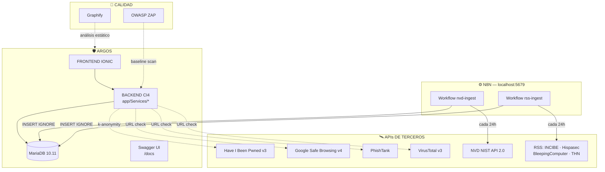

# 🌐 `ARGOS — SERVICIOS EXTERNOS E INTEGRACIONES` 🌐

---

> [!WARNING]
> ***ESTE DOCUMENTO DESCRIBE TODO LO QUE FUNCIONA `FUERA` DEL CÓDIGO PROPIO DE ARGOS: ORQUESTADORES, APIs DE TERCEROS, DOCUMENTACIÓN INTERACTIVA, HERRAMIENTAS DE AUDITORÍA E INFRAESTRUCTURA. SI EL README PRINCIPAL EXPLICA `QUÉ ES` ARGOS, ESTE EXPLICA `DE QUÉ SE RODEA` PARA FUNCIONAR***

- ***EL ECOSISTEMA EXTERNO DE ARGOS SE COMPONE DE `5 BLOQUES`:***

  - ***⚙️ `N8N` — ORQUESTADOR SELF-HOSTED DE INGESTA DE NOTICIAS Y CVEs***
  - ***📖 `SWAGGER UI + OPENAPI 3.0` — DOCUMENTACIÓN INTERACTIVA DE LA API***
  - ***🛰️ `APIs DE TERCEROS` — HIBP, SAFE BROWSING, PHISHTANK, VIRUSTOTAL, NVD, RSS***
  - ***🧪 `HERRAMIENTAS DE CALIDAD` — OWASP ZAP Y GRAPHIFY***
  - ***🐳 `INFRAESTRUCTURA` — DOCKER, DDEV, MARIADB Y VPS***

---

---

## `MAPA DEL ECOSISTEMA EXTERNO` ⭕

> [!NOTE]
> ***NINGÚN SERVICIO EXTERNO TOCA DATOS SENSIBLES DEL USUARIO. EL MODELO ZERO-KNOWLEDGE SE MANTIENE: A LAS APIs DE TERCEROS SOLO VIAJAN `PREFIJOS DE HASH`, `URLs A ANALIZAR` O `NADA` (N8N SOLO DESCARGA DATOS PÚBLICOS)***



---

---

## `⚙️ N8N — ORQUESTADOR DE INGESTA` ⭕

> [!IMPORTANT]
> ***EL BACKEND DE ARGOS `NUNCA` LLAMA DIRECTAMENTE AL NIST NI A LOS FEEDS RSS. ES `N8N` QUIEN DESCARGA, NORMALIZA Y VUELCA LOS DATOS EN LA TABLA `news_cache` CADA 24 HORAS. EL BACKEND SOLO SIRVE DATOS YA COCINADOS***

### `FICHA TÉCNICA` 🔻

| PARÁMETRO | VALOR |
|---|---|
| **Imagen Docker** | `n8nio/n8n:latest` |
| **Contenedor** | `argos-n8n` |
| **URL de acceso** | `http://localhost:5679` (mapeado desde el 5678 interno) |
| **Exposición** | SOLO `127.0.0.1` — INACCESIBLE DESDE FUERA DE LA MÁQUINA |
| **Autenticación** | HTTP BASIC (`admin` / `argos_n8n_local`) + CUENTA OWNER INTERNA |
| **BD interna** | SQLite PERSISTIDA EN `automation/n8n/data/` (GITIGNORED) |
| **Zona horaria** | `Europe/Madrid` · LOCALE `es` |
| **Red Docker** | `ddev_default` (EXTERNAL) PARA RESOLVER `ddev-argos-db` POR DNS |

<br>

### `WORKFLOWS INCLUIDOS` 🔻

| WORKFLOW | FUENTE | FRECUENCIA | QUÉ HACE |
|---|---|---|---|
| **`nvd-ingest.json`** | NVD API 2.0 (NIST) | 24 h | DESCARGA CVEs `CRITICAL`, FILTRA POR KEYWORDS DOMÉSTICAS E INSERTA EN `news_cache` |
| **`rss-ingest.json`** | 4 FEEDS RSS | 24 h | INGESTA DE INCIBE, HISPASEC, BLEEPINGCOMPUTER Y THE HACKER NEWS |

<br>

### `ARRANQUE Y OPERACIÓN` 🔻

```bash
# ARRANCAR (REQUIERE DDEV LEVANTADO ANTES, POR LA RED ddev_default)
> cd automation/n8n
> docker compose up -d

# PARAR
> docker compose down
```

> [!TIP]
> ***LA GUÍA PASO A PASO (IMPORTAR WORKFLOWS, CREAR LA CREDENCIAL MYSQL CONTRA `ddev-argos-db:3306`, ACTIVARLOS) ESTÁ EN [`automation/n8n/SETUP.md`](../automation/n8n/SETUP.md). LA DOC OPERATIVA DEL CONTENEDOR, EN [`automation/n8n/README.md`](../automation/n8n/README.md)***

<br>

### `SEGURIDAD DEL CONTENEDOR` 🔻

> [!CAUTION]
> ***N8N HA TENIDO CVEs RECIENTES (EJ. CVE-2026-21858). MITIGACIONES APLICADAS EN ARGOS:***

- ***✅ PUERTO PUBLICADO SOLO EN `127.0.0.1` — SIN EXPOSICIÓN A LA RED***
- ***✅ HTTP BASIC AUTH ACTIVADO POR DELANTE DEL LOGIN PROPIO DE N8N***
- ***✅ WEBHOOKS DE PRODUCCIÓN DESHABILITADOS (`N8N_DISABLE_PRODUCTION_MAIN_PROCESS_WEBHOOK=true`)***
- ***✅ IMAGEN `latest` CON ACTUALIZACIÓN CONTINUA VÍA `docker compose pull`***

---

---

## `📖 SWAGGER UI + OPENAPI 3.0 — DOCUMENTACIÓN DE LA API` ⭕

> [!NOTE]
> ***TODA LA API REST ESTÁ ESPECIFICADA EN `OPENAPI 3.0.3` Y SE PUEDE EXPLORAR Y PROBAR EN VIVO CON `SWAGGER UI` SIN INSTALAR NADA***

### `CÓMO FUNCIONA` 🔻

| PIEZA | UBICACIÓN | DETALLE |
|---|---|---|
| **Especificación** | `backend/public/docs/openapi.yaml` | OPENAPI 3.0.3 — GENERADA A PARTIR DE `Routes.php` Y LOS CONTROLADORES `Api/V1` |
| **Visor** | `backend/public/docs/index.html` | SWAGGER UI 5 SERVIDO COMO ESTÁTICO (NGINX LO ENTREGA SIN PASAR POR EL ROUTER DE CI4) |
| **URL local** | `https://argos.ddev.site/docs/` | TEMA ADAPTADO A LA PALETA PÚRPURA `#7C3AED` DE ARGOS |
| **Dependencia** | `swagger-ui-dist@5` VÍA CDN (jsDelivr) | SIN BUILD NI DEPENDENCIAS EN COMPOSER |

<br>

### `QUÉ DOCUMENTA` 🔻

- ***`7 GRUPOS DE ENDPOINTS` (TAGS): `Auth`, `TOTP`, `Vault - Items`, `Vault - Folders`, `Auditor`, `Phishing`, `News`***
- ***SOBRE DE RESPUESTA ESTÁNDAR `{ success, data, error }` EN TODOS LOS ENDPOINTS***
- ***ESQUEMA DE SEGURIDAD `Bearer JWT` CON `persistAuthorization` (EL TOKEN SOBREVIVE AL REFRESCO DE LA PÁGINA)***

> [!TIP]
> ***PARA PROBAR ENDPOINTS PROTEGIDOS: HAZ LOGIN DESDE `POST /auth/login` EN EL PROPIO SWAGGER, COPIA EL JWT Y PÉGALO EN EL BOTÓN `Authorize` 🔒***

---

---

## `🛰️ APIs DE TERCEROS` ⭕

> [!IMPORTANT]
> ***CADA API EXTERNA TIENE SU PROPIO SERVICIO PROXY EN `backend/app/Services/`. EL FRONTEND NUNCA HABLA CON ELLAS DIRECTAMENTE: ASÍ LAS API KEYS VIVEN SOLO EN EL `.env` DEL SERVIDOR Y SE PUEDE CACHEAR / LIMITAR EL TRÁFICO***

### `TABLA RESUMEN` 🔻

| API | SERVICIO PROXY | ENDPOINT ARGOS | CACHÉ / LÍMITE | API KEY |
|---|---|---|---|---|
| **Have I Been Pwned v3** | `HibpService.php` | `GET /auditor/hibp/{prefix}` | TABLA `hibp_cache` | OPCIONAL (RANGE API ES PÚBLICA) |
| **Google Safe Browsing v4** | `SafeBrowsingService.php` | `POST /phishing/safebrowsing` | — | `GOOGLE_SAFEBROWSING_KEY` |
| **PhishTank** | `PhishTankService.php` | `POST /phishing/phishtank` | TABLA `phishtank_cache` (6 h) | OPCIONAL |
| **VirusTotal v3** | `VirusTotalService.php` | `POST /phishing/virustotal` | RATE LIMITER INTERNO (TABLA `virustotal_rate_limit`) | `VIRUSTOTAL_API_KEY` |
| **NVD API 2.0 (NIST)** | — (LA CONSUME N8N) | DATOS VÍA `GET /news` | TABLA `news_cache` | NO |
| **RSS (INCIBE, HISPASEC, BLEEPING, THN)** | — (LOS CONSUME N8N) | DATOS VÍA `GET /news` | TABLA `news_cache` | NO |

<br>

### `HAVE I BEEN PWNED — K-ANONYMITY` 🔻

> [!NOTE]
> ***NI ARGOS NI HIBP VEN NUNCA LA CONTRASEÑA NI SU HASH COMPLETO. SOLO VIAJAN LOS `5 PRIMEROS CARACTERES` DEL SHA-1 Y EL CLIENTE COMPARA EL RESTO EN LOCAL***

```
CLIENTE                      BACKEND ARGOS                  HIBP
sha1(passwd) ──prefix(5)──▶  /auditor/hibp/AB12C  ──────▶  /range/AB12C
   ▲                              │ (hibp_cache)              │
   └────── compara sufijos ◀──────┴───── ~800 hashes ◀────────┘
```

<br>

### `PIPELINE DE PHISHING — 4 MOTORES EN CASCADA` 🔻

> [!WARNING]
> ***EL ANÁLISIS ES EN CASCADA PARA MINIMIZAR LLAMADAS A LAS APIs CON CUOTA: SOLO SE AVANZA AL SIGUIENTE MOTOR SI EL VEREDICTO SIGUE SIENDO DUDOSO***

- ***`1. GOOGLE SAFE BROWSING v4` — LISTAS NEGRAS DE GOOGLE (MALWARE + SOCIAL ENGINEERING)***
- ***`2. PHISHTANK` — BASE COMUNITARIA DE PHISHING VERIFICADO, CACHEADA 6 HORAS***
- ***`3. HEURÍSTICAS LOCALES` — TYPOSQUATTING, ATAQUES IDN, EDAD DEL DOMINIO (SIN COSTE)***
- ***`4. VIRUSTOTAL v3` — 70+ MOTORES ANTIVIRUS, EL RECURSO MÁS CARO Y POR ESO EL ÚLTIMO***

> [!CAUTION]
> ***VIRUSTOTAL FREE TIER: `4 PETICIONES/MIN` Y `500/DÍA`. EL RATE LIMITER INTERNO DEVUELVE `HTTP 429` ANTES DE QUEMAR LA CUOTA EXTERNA. SAFE BROWSING ES GRATUITO SOLO PARA USO NO COMERCIAL — LA VERSIÓN COMERCIAL MIGRARÍA A `WEB RISK API`***

<br>

### `CONFIGURACIÓN DE API KEYS` 🔻

```bash
# EN backend/.env
HIBP_API_KEY=                          # OPCIONAL (TIER PÚBLICO YA FUNCIONA)
GOOGLE_SAFEBROWSING_KEY=tu_key_aqui    # GRATIS EN GOOGLE CLOUD CONSOLE
PHISHTANK_API_KEY=                     # OPCIONAL
VIRUSTOTAL_API_KEY=tu_key_aqui         # GRATIS EN virustotal.com
```

---

---

## `🤖 PROXY LLM — ASISTENTE IA (PREMIUM)` ⭕

> [!NOTE]
> ***EL CHATBOT PEDAGÓGICO NO LLAMA AL LLM DESDE EL MÓVIL: EL BACKEND ACTÚA COMO `PROXY`, IGUAL QUE CON LAS APIs DE PHISHING. ASÍ LA KEY DEL PROVEEDOR NUNCA SE EMBEBE EN LA APP***

| OPCIÓN | PROVEEDOR | CUÁNDO |
|---|---|---|
| **GPT-4o-mini** | OpenAI | MVP — ~0.15 $/M TOKENS DE ENTRADA |
| **Claude Haiku 4.5** | Anthropic | ALTERNATIVA PREMIUM — MEJOR RAZONAMIENTO ESTRUCTURADO |
| **Ollama + Llama 3.1 8B** | SELF-HOSTED EN VPS | DEMO DE PRIVACIDAD TOTAL (NADA SALE DEL SERVIDOR) |

---

---

## `🧪 HERRAMIENTAS DE CALIDAD Y AUDITORÍA` ⭕

### `OWASP ZAP — AUDITORÍA DE SEGURIDAD` 🔻

> [!IMPORTANT]
> ***LA API SE AUDITA CON `OWASP ZAP` EN MODO BASELINE. EL INFORME COMPLETO CON LAS MITIGACIONES APLICADAS ESTÁ EN [`docs/security/AUDITORIA_OWASP_ZAP.md`](security/AUDITORIA_OWASP_ZAP.md) Y LA CONFIGURACIÓN DEL ESCANEO EN [`docs/security/zap-baseline.conf`](security/zap-baseline.conf)***

- ***✅ OBJETIVO KPI: `0 VULNERABILIDADES CRÍTICAS`***
- ***✅ ESCANEO PASIVO BASELINE CONTRA `https://argos.ddev.site`***

<br>

### `GRAPHIFY — GRAFO DE CONOCIMIENTO DEL CÓDIGO` 🔻

> [!TIP]
> ***HERRAMIENTA DE ANÁLISIS ESTÁTICO QUE CONSTRUYE UN GRAFO DE TODO EL CÓDIGO (NODOS = ARCHIVOS/CLASES/FUNCIONES, ARISTAS = RELACIONES DE USO). SE USA PARA AUDITAR LA ARQUITECTURA, DETECTAR GOD NODES Y DOCUMENTAR EL TFG. DETALLE COMPLETO EN EL README PRINCIPAL***

```bash
> graphify analyze . --out ./graphify-out     # ANÁLISIS COMPLETO
> graphify update .                           # REFRESCO AST-ONLY TRAS CAMBIOS
```

---

---

## `🐳 INFRAESTRUCTURA Y SERVICIOS DE SOPORTE` ⭕

| SERVICIO | ROL | DETALLE |
|---|---|---|
| **DDEV** | ENTORNO PHP LOCAL | LEVANTA NGINX + PHP 8.2 + MARIADB 10.11 EN DOCKER · `https://argos.ddev.site` |
| **Docker Compose v2** | CONTENEDORES | N8N AISLADO + RED `ddev_default` COMPARTIDA CON DDEV |
| **MariaDB 10.11** | BASE DE DATOS | PUNTO DE ENCUENTRO ENTRE BACKEND Y N8N (TABLA `news_cache`) |
| **GitHub** | VCS + GESTIÓN | KANBAN DE 33 ISSUES · GIT FLOW (`main` ← `develop` ← `feature/*`) |
| **GitHub Actions** | CI/CD | PENDIENTE PARA EL DESPLIEGUE FUTURO |
| **Hetzner VPS** | PRODUCCIÓN | DESTINO DE DESPLIEGUE DE LA VERSIÓN FINAL |
| **WSL2** | HOST DE DESARROLLO | TODO EL TOOLING (DOCKER, DDEV, NODE) CORRE DENTRO DE WSL2 EN WINDOWS |

<br>

### `ORDEN DE ARRANQUE RECOMENDADO` 🔻

> [!CAUTION]
> ***EL ORDEN IMPORTA: N8N SE CONECTA A LA RED `ddev_default`, ASÍ QUE DDEV DEBE ESTAR ARRANCADO `ANTES` QUE N8N***

```bash
# 1. BACKEND + BASE DE DATOS
> cd backend && ddev start

# 2. AUTOMATIZACIÓN (REQUIERE EL PASO 1)
> cd automation/n8n && docker compose up -d

# 3. FRONTEND
> cd frontend && ionic serve

# 4. DOCUMENTACIÓN DE LA API (YA SERVIDA POR DDEV)
#    ABRIR https://argos.ddev.site/docs/
```

---

---

> [!IMPORTANT]
> ***ARGOS DELEGA EN SERVICIOS EXTERNOS TODO LO QUE NO ES SU NÚCLEO (INGESTA, INTELIGENCIA DE AMENAZAS, DOCUMENTACIÓN INTERACTIVA), PERO SIN CEDER NUNCA DATOS SENSIBLES: `LA CONFIANZA SE QUEDA EN EL CLIENTE` 🛡️***
